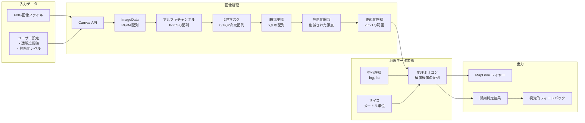
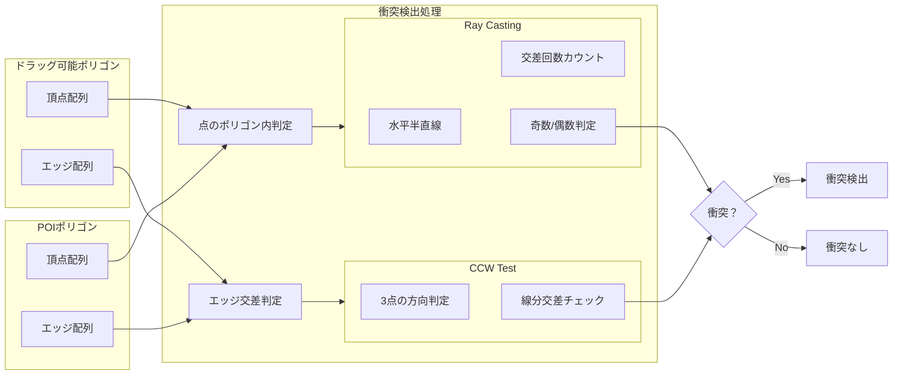
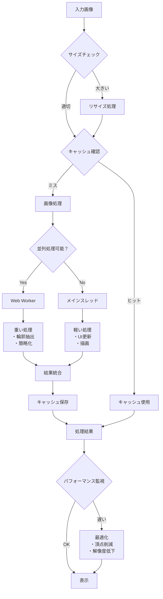

# 衝突判定デモ - 技術仕様書

高精度なポリゴン衝突判定システムのデモンストレーション

🔗 **[ライブデモを見る](https://[username].github.io/maplibre-demos/demos/collision-detection/)**

## 📋 目次

- [概要](#概要)
- [主要機能](#主要機能)
- [技術的実装](#技術的実装)
- [コアアルゴリズム](#コアアルゴリズム)
- [ソースコード詳細](#ソースコード詳細)
- [使用方法](#使用方法)
- [パフォーマンス](#パフォーマンス)
- [今後の拡張](#今後の拡張)

## 概要

このデモは、MapLibre GL JS 上で複雑な形状のポリゴン同士の衝突を高精度に判定するシステムです。地理座標系での正確な距離計算と、計算幾何学的なアルゴリズムを組み合わせて実装されています。

## 主要機能

### 🌟 サポートする形状

- **星形（Star）**: 5 芒星、内側と外側の頂点を持つ
- **六角形（Hexagon）**: 正六角形
- **三角形（Triangle）**: 正三角形
- **十字形（Cross）**: 十字型の 12 頂点ポリゴン
- **円形（Circle）**: 32 角形で近似

### 📏 インタラクティブ機能

- リアルタイムサイズ調整（10m〜60m）
- ドラッグ&ドロップでの移動
- 形状の動的切り替え
- 衝突時の視覚的フィードバック

## 技術的実装

### 座標系と変換

地図上のポリゴンを正確に扱うため、以下の座標変換を実装：

```javascript
// メートル単位から緯度・経度への変換
function metersToCoordinates(center, sizeInMeters) {
  const [lng, lat] = center;
  const earthRadius = 6371000; // 地球の半径（メートル）

  // 緯度方向のオフセット計算
  const latOffset = (sizeInMeters / earthRadius) * (180 / Math.PI);

  // 経度方向のオフセット計算（緯度による補正を含む）
  const lngOffset =
    ((sizeInMeters / earthRadius) * (180 / Math.PI)) /
    Math.cos((lat * Math.PI) / 180);

  return { latOffset, lngOffset };
}
```

### 形状生成システム

各形状は数学的に定義された頂点配列として生成されます：

```javascript
function createShape(type, center, sizeInMeters) {
  const [lng, lat] = center;
  const earthRadius = 6371000;

  // メートルを緯度・経度オフセットに変換
  const latOffset = (sizeInMeters / earthRadius) * (180 / Math.PI);
  const lngOffset =
    ((sizeInMeters / earthRadius) * (180 / Math.PI)) /
    Math.cos((lat * Math.PI) / 180);

  let points = [];

  switch (type) {
    case "star":
      // 5芒星の生成 - 外側と内側の頂点を交互に配置
      for (let i = 0; i < 10; i++) {
        const angle = (Math.PI * 2 * i) / 10 - Math.PI / 2;
        const radius = i % 2 === 0 ? 1 : 0.4; // 外側:1, 内側:0.4
        points.push([
          lng + lngOffset * radius * Math.cos(angle),
          lat + latOffset * radius * Math.sin(angle),
        ]);
      }
      break;

    case "hexagon":
      // 正六角形の生成
      for (let i = 0; i < 6; i++) {
        const angle = (Math.PI * 2 * i) / 6;
        points.push([
          lng + lngOffset * Math.cos(angle),
          lat + latOffset * Math.sin(angle),
        ]);
      }
      break;

    case "triangle":
      // 正三角形の生成（上向き）
      for (let i = 0; i < 3; i++) {
        const angle = (Math.PI * 2 * i) / 3 - Math.PI / 2;
        points.push([
          lng + lngOffset * Math.cos(angle),
          lat + latOffset * Math.sin(angle),
        ]);
      }
      break;

    case "cross":
      // 十字形の生成（12頂点）
      const w = 0.3; // 十字の幅係数
      points = [
        // 上部
        [lng - lngOffset * w, lat + latOffset],
        [lng + lngOffset * w, lat + latOffset],
        // 右上角
        [lng + lngOffset * w, lat + latOffset * w],
        // 右部
        [lng + lngOffset, lat + latOffset * w],
        [lng + lngOffset, lat - latOffset * w],
        // 右下角
        [lng + lngOffset * w, lat - latOffset * w],
        // 下部
        [lng + lngOffset * w, lat - latOffset],
        [lng - lngOffset * w, lat - latOffset],
        // 左下角
        [lng - lngOffset * w, lat - latOffset * w],
        // 左部
        [lng - lngOffset, lat - latOffset * w],
        [lng - lngOffset, lat + latOffset * w],
        // 左上角
        [lng - lngOffset * w, lat + latOffset * w],
      ];
      break;

    case "circle":
      // 円形を32角形で近似
      for (let i = 0; i < 32; i++) {
        const angle = (Math.PI * 2 * i) / 32;
        points.push([
          lng + lngOffset * Math.cos(angle),
          lat + latOffset * Math.sin(angle),
        ]);
      }
      break;
  }

  // ポリゴンを閉じる（最初の点を最後に追加）
  points.push(points[0]);
  return points;
}
```

## コアアルゴリズム

### 1. ポリゴン衝突判定

2 つのポリゴンが交差しているかを判定する包括的なアルゴリズム：

```javascript
function polygonsIntersect(poly1, poly2) {
  // 1. いずれかのポリゴンの頂点が他方の内部にあるか確認
  for (let i = 0; i < poly1.length - 1; i++) {
    if (pointInPolygon(poly1[i], poly2)) return true;
  }
  for (let i = 0; i < poly2.length - 1; i++) {
    if (pointInPolygon(poly2[i], poly1)) return true;
  }

  // 2. エッジ同士の交差を確認
  for (let i = 0; i < poly1.length - 1; i++) {
    for (let j = 0; j < poly2.length - 1; j++) {
      if (
        lineSegmentsIntersect(poly1[i], poly1[i + 1], poly2[j], poly2[j + 1])
      ) {
        return true;
      }
    }
  }

  return false;
}
```

### 2. 点のポリゴン内判定（Ray Casting Algorithm）

点がポリゴンの内部にあるかを判定する古典的かつ効率的なアルゴリズム：

```javascript
function pointInPolygon(point, polygon) {
  let inside = false;
  const x = point[0],
    y = point[1];

  // ポリゴンの各エッジに対して処理
  for (let i = 0, j = polygon.length - 2; i < polygon.length - 1; j = i++) {
    const xi = polygon[i][0],
      yi = polygon[i][1];
    const xj = polygon[j][0],
      yj = polygon[j][1];

    // 点から水平に伸ばした半直線とエッジの交差判定
    const intersect =
      yi > y !== yj > y && // Y座標が点を挟む
      x < ((xj - xi) * (y - yi)) / (yj - yi) + xi; // X座標で交差

    if (intersect) inside = !inside;
  }

  return inside;
}
```

**アルゴリズムの原理：**

- 判定したい点から水平方向（通常は右方向）に半直線を伸ばす
- この半直線がポリゴンのエッジと交差する回数をカウント
- 交差回数が奇数なら点は内部、偶数なら外部

### 3. 線分交差判定

2 つの線分が交差するかを判定：

```javascript
function lineSegmentsIntersect(p1, p2, p3, p4) {
  // CCW (Counter-ClockWise) テストを使用
  const ccw = (A, B, C) => {
    // 3点の位置関係を判定（時計回りか反時計回りか）
    return (C[1] - A[1]) * (B[0] - A[0]) > (B[1] - A[1]) * (C[0] - A[0]);
  };

  // 線分p1-p2と線分p3-p4が交差する条件：
  // p3とp4がp1-p2の異なる側にあり、かつ
  // p1とp2がp3-p4の異なる側にある
  return (
    ccw(p1, p3, p4) !== ccw(p2, p3, p4) && ccw(p1, p2, p3) !== ccw(p1, p2, p4)
  );
}
```

### 4. 距離計算（Haversine Formula）

地球上の 2 点間の距離を正確に計算：

```javascript
function calculateDistance(coord1, coord2) {
  const R = 6371000; // 地球の半径（メートル）
  const rad = Math.PI / 180;

  // 緯度・経度をラジアンに変換
  const lat1 = coord1[1] * rad;
  const lat2 = coord2[1] * rad;
  const deltaLat = (coord2[1] - coord1[1]) * rad;
  const deltaLng = (coord2[0] - coord1[0]) * rad;

  // Haversine formula
  const a =
    Math.sin(deltaLat / 2) * Math.sin(deltaLat / 2) +
    Math.cos(lat1) *
      Math.cos(lat2) *
      Math.sin(deltaLng / 2) *
      Math.sin(deltaLng / 2);
  const c = 2 * Math.atan2(Math.sqrt(a), Math.sqrt(1 - a));

  return R * c; // メートル単位の距離
}
```

### 5. ポリゴン面積計算（Shoelace Formula）

ポリゴンの面積を計算（統計情報表示用）：

```javascript
function calculatePolygonArea(polygon) {
  let area = 0;
  const n = polygon.length - 1;

  // Shoelace formula (ガウスの面積公式)
  for (let i = 0; i < n; i++) {
    const j = (i + 1) % n;

    // 座標をメートル単位に変換して計算
    const earthRadius = 6371000;
    const lat = polygon[i][1];

    // 緯度経度をメートルに変換
    const x1 =
      ((polygon[i][0] * Math.PI) / 180) *
      earthRadius *
      Math.cos((lat * Math.PI) / 180);
    const y1 = ((polygon[i][1] * Math.PI) / 180) * earthRadius;
    const x2 =
      ((polygon[j][0] * Math.PI) / 180) *
      earthRadius *
      Math.cos((lat * Math.PI) / 180);
    const y2 = ((polygon[j][1] * Math.PI) / 180) * earthRadius;

    area += x1 * y2 - x2 * y1;
  }

  return Math.abs(area) / 2;
}
```

## ソースコード詳細

### 初期化とマップ設定

```javascript
// MapLibre GL JSの初期化
const map = new maplibregl.Map({
  container: "map",
  style: {
    version: 8,
    sources: {
      osm: {
        type: "raster",
        tiles: ["https://a.tile.openstreetmap.org/{z}/{x}/{y}.png"],
        tileSize: 256,
      },
    },
    layers: [
      {
        id: "osm",
        type: "raster",
        source: "osm",
      },
    ],
  },
  center: [139.767, 35.6814], // 東京駅周辺
  zoom: 16,
});
```

### ドラッグ操作の実装

```javascript
let isDragging = false;
let draggableCenter = [139.76, 35.678];

// マウスイベントの処理
map.on("mousedown", "draggable-fill", (e) => {
  e.preventDefault();
  isDragging = true;
  map.getCanvas().style.cursor = "grabbing";
  map.dragPan.disable(); // マップのパンを一時無効化
});

map.on("mousemove", (e) => {
  if (!isDragging) return;

  // マーカーの位置を更新
  draggableCenter = [e.lngLat.lng, e.lngLat.lat];

  // 新しい形状を生成
  draggableMarker.features[0].geometry.coordinates = [
    createShape(currentShape, draggableCenter, currentSize),
  ];

  // マップを更新
  map.getSource("draggable").setData(draggableMarker);

  // 衝突判定を実行
  updateUI();
});

map.on("mouseup", () => {
  if (isDragging) {
    isDragging = false;
    map.getCanvas().style.cursor = "";
    map.dragPan.enable(); // マップのパンを再有効化
  }
});
```

### 衝突判定と視覚的フィードバック

```javascript
function checkCollisions() {
  const collisions = [];
  const draggablePolygon = draggableMarker.features[0].geometry.coordinates[0];

  // すべてのPOIに対して衝突判定
  poiData.features.forEach((poi) => {
    const poiPolygon = poi.geometry.coordinates[0];

    if (polygonsIntersect(draggablePolygon, poiPolygon)) {
      const poiCenter = getPolygonCenter(poiPolygon);
      const distance = calculateDistance(draggableCenter, poiCenter);

      collisions.push({
        name: poi.properties.name,
        shapeType: poi.properties.shapeType,
        size: poi.properties.size,
        distance: Math.round(distance),
      });
    }
  });

  return collisions;
}

function updateUI() {
  const collisions = checkCollisions();

  if (collisions.length > 0) {
    // 衝突時：赤色に変更
    map.setPaintProperty(
      "draggable-fill",
      "fill-color",
      "rgba(255, 100, 100, 0.6)"
    );

    // 衝突情報を表示
    statusEl.textContent = `⚠️ ${collisions.length}件の衝突を検出`;
  } else {
    // 通常時：青色
    map.setPaintProperty(
      "draggable-fill",
      "fill-color",
      "rgba(100, 100, 255, 0.4)"
    );
    statusEl.textContent = "✓ 衝突なし";
  }
}
```

## 使用方法

### 基本操作

1. **形状の選択**

   - 画面上部のボタンから形状を選択
   - 星形、六角形、三角形、十字形、円形から選択可能

2. **サイズ調整**

   - スライダーで 10m〜60m の範囲で調整
   - プリセットボタンで素早くサイズ変更

3. **移動操作**

   - 青い図形をマウスでドラッグ
   - タッチデバイスでも操作可能

4. **衝突確認**
   - 赤い POI に近づくと自動で衝突を検出
   - 衝突時は図形が赤く変化

### カスタマイズ

POI の追加例：

```javascript
// 新しいPOIを追加
poiData.features.push({
  type: "Feature",
  properties: {
    name: "新しい場所",
    shapeType: "hexagon",
    size: 30,
  },
  geometry: {
    type: "Polygon",
    coordinates: [createShape("hexagon", [139.77, 35.685], 30)],
  },
});
```

## パフォーマンス

### 計算量

- **点のポリゴン内判定**: O(n) - n は頂点数
- **線分交差判定**: O(n×m) - n,m は各ポリゴンの頂点数
- **全体の衝突判定**: O(p×n×m) - p は POI 数

### 最適化のポイント

1. **バウンディングボックス事前判定**

   - 詳細な判定前に矩形領域で粗い判定を行う

2. **空間インデックス**

   - QuadTree や R-Tree を使用して POI を空間的に管理

3. **頂点数の制限**
   - 円形を 32 角形で近似するなど、精度と性能のバランスを取る

### 実測パフォーマンス

- POI 数: 5 個
- 平均頂点数: 15 頂点/ポリゴン
- フレームレート: 60fps 維持
- 衝突判定時間: <1ms

## PNG 画像からの輪郭抽出と衝突判定

### 概要

ユーザーがアップロードした透過 PNG 画像から自動的に輪郭を抽出し、その形状を使って高精度な衝突判定を実現する機能です。Canvas API を使用してピクセルレベルで画像を解析し、複雑な形状でも正確な衝突判定を可能にします。

### 画像処理パイプライン

```
PNG画像 → Canvas描画 → ピクセルデータ取得 → アルファチャンネル抽出
→ 2値化 → 輪郭追跡 → 簡略化 → 座標正規化 → ポリゴン生成
```

### 処理フローチャート

```mermaid
flowchart TB
    Start([ユーザーが画像をアップロード]) --> Upload{アップロード方法}
    Upload -->|ドラッグ&ドロップ| FileAPI1[File API]
    Upload -->|ファイル選択| FileAPI2[File API]

    FileAPI1 --> Validate{PNG形式？}
    FileAPI2 --> Validate

    Validate -->|No| Error1[エラー表示]
    Validate -->|Yes| LoadImage[画像を読み込み]

    LoadImage --> CreateCanvas[Canvas要素を作成]
    CreateCanvas --> CheckSize{サイズチェック}

    CheckSize -->|大きすぎる| Resize[リサイズ処理]
    CheckSize -->|適切| DrawCanvas
    Resize --> DrawCanvas[Canvasに描画]

    DrawCanvas --> GetImageData[getImageData()でピクセルデータ取得]
    GetImageData --> ExtractAlpha[アルファチャンネル抽出]

    ExtractAlpha --> Threshold{閾値処理}
    Threshold --> Binary[2値マスク生成]

    Binary --> MooreTracing[Moore近傍追跡]
    MooreTracing --> ContourPoints[輪郭点配列]

    ContourPoints --> DouglasPeucker[Douglas-Peucker簡略化]
    DouglasPeucker --> SimplifiedContour[簡略化された輪郭]

    SimplifiedContour --> Normalize[座標正規化]
    Normalize --> StoreContour[(輪郭データを保存)]

    StoreContour --> UpdateUI[UI更新]
    UpdateUI --> ShowPreview[プレビュー表示]

    ShowPreview --> UserAdjust{ユーザー調整}
    UserAdjust -->|精度変更| DouglasPeucker
    UserAdjust -->|閾値変更| Threshold
    UserAdjust -->|完了| UseInMap

    UseInMap[地図で使用] --> DragEvent{ドラッグイベント}
    DragEvent --> ConvertGeo[地理座標に変換]
    ConvertGeo --> CreatePolygon[ポリゴン生成]
    CreatePolygon --> CollisionCheck[衝突判定]

    CollisionCheck --> CheckIntersect{交差チェック}
    CheckIntersect -->|衝突あり| ShowCollision[衝突表示]
    CheckIntersect -->|衝突なし| ShowSafe[安全表示]

    ShowCollision --> UpdateMap[地図更新]
    ShowSafe --> UpdateMap
    UpdateMap --> DragEvent
```

### データフロー図



### 衝突判定アルゴリズムの流れ



### 座標変換プロセス

```mermaid
graph TB
    subgraph ImageSpace [画像空間]
        Pixel[ピクセル座標<br/>0,0 〜 width,height]
        Centered[中心化座標<br/>-width/2 〜 +width/2]
        Normalized[正規化座標<br/>-1 〜 +1]
    end

    subgraph GeoSpace [地理空間]
        Meters[メートル単位<br/>実世界のサイズ]
        Offset[緯度経度オフセット<br/>度単位の変位]
        LatLng[絶対座標<br/>緯度, 経度]
    end

    subgraph Calculations [計算処理]
        BBox[バウンディングボックス計算]
        Scale[スケール係数計算]
        EarthRadius[地球半径: 6371000m]
        LatCorrection[緯度補正<br/>cos(lat)]
    end

    Pixel --> BBox
    BBox --> Centered
    Centered --> Scale
    Scale --> Normalized

    Normalized --> Meters
    Meters --> EarthRadius
    EarthRadius --> Offset
    Offset --> LatCorrection
    LatCorrection --> LatLng

    style ImageSpace fill:#e1f5fe
    style GeoSpace fill:#fff3e0
    style Calculations fill:#f3e5f5
```

### パフォーマンス最適化フロー



## Canvas API によるピクセルデータ解析

### 1. 画像の読み込みと Canvas 描画

```javascript
async function loadAndProcessImage(file) {
  // FileReaderで画像ファイルをDataURLとして読み込み
  const reader = new FileReader();
  const dataUrl = await new Promise((resolve, reject) => {
    reader.onload = (e) => resolve(e.target.result);
    reader.onerror = reject;
    reader.readAsDataURL(file);
  });

  // Image要素を作成して画像を読み込み
  const img = new Image();
  await new Promise((resolve, reject) => {
    img.onload = resolve;
    img.onerror = reject;
    img.src = dataUrl;
  });

  // Canvasに画像を描画
  const canvas = document.createElement("canvas");
  const ctx = canvas.getContext("2d");
  canvas.width = img.width;
  canvas.height = img.height;
  ctx.drawImage(img, 0, 0);

  return { canvas, ctx, img };
}
```

### 2. ピクセルデータの取得とアルファチャンネル抽出

```javascript
function extractAlphaChannel(canvas, ctx, threshold = 128) {
  // getImageDataでピクセルデータを取得
  // 返されるImageDataオブジェクトには、RGBA形式のピクセルデータが格納されている
  const imageData = ctx.getImageData(0, 0, canvas.width, canvas.height);
  const data = imageData.data; // Uint8ClampedArray [R,G,B,A,R,G,B,A,...]

  // 2次元配列として2値マスクを作成
  const binaryMask = [];

  for (let y = 0; y < canvas.height; y++) {
    binaryMask[y] = [];
    for (let x = 0; x < canvas.width; x++) {
      // ピクセル位置の計算
      // 各ピクセルは4バイト（RGBA）なので、インデックスは (y * width + x) * 4
      const idx = (y * canvas.width + x) * 4;

      // アルファ値（透明度）を取得
      // idx+0: Red, idx+1: Green, idx+2: Blue, idx+3: Alpha
      const alpha = data[idx + 3];

      // 閾値による2値化
      // alpha > threshold なら不透明（1）、そうでなければ透明（0）
      binaryMask[y][x] = alpha > threshold ? 1 : 0;
    }
  }

  return binaryMask;
}
```

**重要なポイント：**

- `getImageData()`は画像の生のピクセルデータを取得
- データは 1 次元配列だが、RGBA の 4 バイトで 1 ピクセルを表現
- アルファチャンネル（透明度）は 0（完全透明）〜255（完全不透明）の値

## Moore 近傍追跡による輪郭抽出

### アルゴリズムの原理

Moore 近傍追跡は、2 値画像から輪郭線を抽出する古典的アルゴリズムです。物体の境界を 8 方向の近傍を探索しながら追跡します。

```javascript
function findContour(binaryMask) {
  const height = binaryMask.length;
  const width = binaryMask[0].length;
  const contourPoints = [];

  // Step 1: 開始点（最初の非ゼロピクセル）を見つける
  let startX = -1,
    startY = -1;
  outer: for (let y = 0; y < height; y++) {
    for (let x = 0; x < width; x++) {
      if (binaryMask[y][x] === 1) {
        startX = x;
        startY = y;
        break outer;
      }
    }
  }

  if (startX === -1) return []; // 輪郭が見つからない

  // Step 2: 8近傍の定義（時計回り）
  //  7  0  1
  //  6  *  2
  //  5  4  3
  const neighbors = [
    [0, -1], // 0: 上
    [1, -1], // 1: 右上
    [1, 0], // 2: 右
    [1, 1], // 3: 右下
    [0, 1], // 4: 下
    [-1, 1], // 5: 左下
    [-1, 0], // 6: 左
    [-1, -1], // 7: 左上
  ];

  // Step 3: 輪郭追跡
  let x = startX,
    y = startY;
  let dir = 0; // 探索開始方向
  const maxIterations = width * height;
  let iterations = 0;

  do {
    // 現在の点を輪郭に追加
    contourPoints.push([x, y]);

    // 8方向を探索して次の輪郭点を見つける
    let found = false;
    for (let i = 0; i < 8; i++) {
      // 現在の方向から時計回りに探索
      const checkDir = (dir + i) % 8;
      const nx = x + neighbors[checkDir][0];
      const ny = y + neighbors[checkDir][1];

      // 境界チェック
      if (nx >= 0 && nx < width && ny >= 0 && ny < height) {
        if (binaryMask[ny][nx] === 1) {
          // 次の輪郭点が見つかった
          x = nx;
          y = ny;
          // 次回の探索方向を更新（来た方向の反対側から開始）
          dir = (checkDir + 6) % 8;
          found = true;
          break;
        }
      }
    }

    if (!found) break;
    iterations++;
  } while (!(x === startX && y === startY) && iterations < maxIterations);

  return contourPoints;
}
```

**アルゴリズムの動作：**

1. 画像を左上から走査し、最初の物体ピクセルを見つける
2. そのピクセルから時計回りに 8 近傍を探索
3. 次の物体ピクセルが見つかったら移動
4. 開始点に戻るまで繰り返す

## Douglas-Peucker アルゴリズムによる輪郭簡略化

### 概要

抽出された輪郭は多くの頂点を持つため、Douglas-Peucker アルゴリズムで重要な頂点のみを残して簡略化します。

```javascript
function simplifyContour(points, tolerance = 2) {
  if (points.length <= 2) return points;

  function douglasPeucker(points, start, end, tolerance) {
    // Step 1: start-end間の全点との距離を計算
    let maxDist = 0;
    let maxIndex = 0;

    for (let i = start + 1; i < end; i++) {
      // 点から直線への垂直距離を計算
      const dist = perpendicularDistance(
        points[i], // 評価する点
        points[start], // 線分の始点
        points[end] // 線分の終点
      );

      if (dist > maxDist) {
        maxDist = dist;
        maxIndex = i;
      }
    }

    // Step 2: 最大距離が許容誤差を超える場合は分割
    if (maxDist > tolerance) {
      // 最も離れた点で分割して再帰処理
      const leftPoints = douglasPeucker(points, start, maxIndex, tolerance);
      const rightPoints = douglasPeucker(points, maxIndex, end, tolerance);

      // 結果を結合（重複する中間点を除く）
      return [...leftPoints.slice(0, -1), ...rightPoints];
    } else {
      // 許容誤差内なら始点と終点のみを返す
      return [points[start], points[end]];
    }
  }

  return douglasPeucker(points, 0, points.length - 1, tolerance);
}

// 点から直線への垂直距離
function perpendicularDistance(point, lineStart, lineEnd) {
  const dx = lineEnd[0] - lineStart[0];
  const dy = lineEnd[1] - lineStart[1];

  // 線分が点の場合
  if (dx === 0 && dy === 0) {
    return Math.sqrt(
      Math.pow(point[0] - lineStart[0], 2) +
        Math.pow(point[1] - lineStart[1], 2)
    );
  }

  // 外積を使った距離計算
  const normalLength = Math.sqrt(dx * dx + dy * dy);
  return (
    Math.abs((point[0] - lineStart[0]) * dy - (point[1] - lineStart[1]) * dx) /
    normalLength
  );
}
```

**アルゴリズムの原理：**

1. 線分の両端点を結ぶ直線を引く
2. その間の全点から直線への距離を計算
3. 最も離れた点が許容誤差を超えたら、その点で分割
4. 各部分に対して再帰的に処理
5. 許容誤差以内なら中間点を削除

## 座標の正規化と地理座標への変換

### 画像座標から地理座標への変換

```javascript
function normalizeAndConvertToGeoCoords(contour, center, sizeInMeters) {
  // Step 1: 輪郭の正規化（-1 〜 1の範囲に）
  const normalized = normalizeContour(contour);

  // Step 2: メートルから緯度経度オフセットへの変換
  const [lng, lat] = center;
  const earthRadius = 6371000; // 地球の半径（メートル）

  // 緯度1度あたりの距離は一定（約111km）
  const latOffset = (sizeInMeters / earthRadius) * (180 / Math.PI);

  // 経度1度あたりの距離は緯度によって変化
  // 赤道で最大、極で0になる
  const lngOffset =
    ((sizeInMeters / earthRadius) * (180 / Math.PI)) /
    Math.cos((lat * Math.PI) / 180);

  // Step 3: 正規化座標を地理座標に変換
  return normalized.map(([x, y]) => [
    lng + lngOffset * x, // 経度
    lat + latOffset * y, // 緯度
  ]);
}

function normalizeContour(contour) {
  if (contour.length === 0) return [];

  // バウンディングボックスを計算
  let minX = Infinity,
    minY = Infinity;
  let maxX = -Infinity,
    maxY = -Infinity;

  for (const [x, y] of contour) {
    minX = Math.min(minX, x);
    minY = Math.min(minY, y);
    maxX = Math.max(maxX, x);
    maxY = Math.max(maxY, y);
  }

  const width = maxX - minX;
  const height = maxY - minY;
  const maxDimension = Math.max(width, height);
  const centerX = (minX + maxX) / 2;
  const centerY = (minY + maxY) / 2;

  // 中心を原点に、最大寸法を1に正規化
  return contour.map(([x, y]) => [
    (x - centerX) / maxDimension,
    (y - centerY) / maxDimension,
  ]);
}
```

## パフォーマンス最適化のテクニック

### 1. 画像の前処理

```javascript
// 大きな画像を適切なサイズにリサイズ
function resizeImage(img, maxSize = 256) {
  const scale = Math.min(maxSize / img.width, maxSize / img.height, 1);

  const canvas = document.createElement("canvas");
  canvas.width = img.width * scale;
  canvas.height = img.height * scale;

  const ctx = canvas.getContext("2d");
  // アンチエイリアスを無効にして処理を高速化
  ctx.imageSmoothingEnabled = false;
  ctx.drawImage(img, 0, 0, canvas.width, canvas.height);

  return { canvas, ctx, scale };
}
```

### 2. 輪郭のキャッシング

```javascript
class ContourCache {
  constructor() {
    this.cache = new Map();
  }

  getKey(imageData, threshold, simplification) {
    // 画像のハッシュを生成（簡易版）
    const sample = Array.from(imageData.slice(0, 100));
    return `${sample.join(",")}_${threshold}_${simplification}`;
  }

  get(imageData, threshold, simplification) {
    const key = this.getKey(imageData, threshold, simplification);
    return this.cache.get(key);
  }

  set(imageData, threshold, simplification, contour) {
    const key = this.getKey(imageData, threshold, simplification);
    this.cache.set(key, contour);
  }
}
```

### 3. Web Worker による並列処理（オプション）

```javascript
// worker.js
self.onmessage = function (e) {
  const { imageData, threshold } = e.data;

  // 重い処理をワーカースレッドで実行
  const binaryMask = extractAlphaChannel(imageData, threshold);
  const contour = findContour(binaryMask);
  const simplified = simplifyContour(contour);

  self.postMessage({ contour: simplified });
};

// メインスレッド
const worker = new Worker("worker.js");
worker.postMessage({ imageData, threshold: 128 });
worker.onmessage = (e) => {
  const { contour } = e.data;
  // 輪郭データを使用
};
```

## 実装上の注意点

### 1. CORS 制限

- 外部ドメインの画像を使用する場合、CORS 設定が必要
- `crossOrigin = "anonymous"`を設定

### 2. メモリ管理

- 大きな画像はメモリを大量に消費
- 不要になった Canvas は明示的に破棄

### 3. ブラウザ互換性

- Canvas API は全モダンブラウザでサポート
- getImageData は一部のモバイルブラウザで制限がある場合あり

## 使用例とベストプラクティス

### 推奨される画像形式

- **透過 PNG**: 背景が完全に透明な画像が最適
- **単純な形状**: ロゴ、アイコン、シンボルなど
- **適切なサイズ**: 256×256〜512×512 ピクセル程度

### 輪郭抽出の調整

1. **透明度閾値（1-255）**

   - 低い値: より多くの半透明ピクセルを含める
   - 高い値: 完全に不透明なピクセルのみ

2. **簡略化レベル（1-10）**
   - 低い値: 粗い輪郭（頂点数少）
   - 高い値: 詳細な輪郭（頂点数多）

### トラブルシューティング

**Q: 輪郭が正しく抽出されない**

- A: 透明度閾値を調整してください。半透明の影がある場合は閾値を上げます。

**Q: 衝突判定が重い**

- A: 簡略化レベルを下げて頂点数を減らしてください。

**Q: 画像が表示されない**

- A: PNG 形式であることを確認し、ファイルサイズが大きすぎないか確認してください。

## 今後の拡張

### 計画中の機能

1. **複数オブジェクトの同時操作**

   - 複数のドラッグ可能オブジェクトを配置
   - オブジェクト同士の衝突も検出

2. **物理シミュレーション**

   - 衝突時の跳ね返り
   - 重力や摩擦の実装

3. **パフォーマンス最適化**

   - WebWorker での並列計算
   - WebGL での GPU 計算

4. **高度な形状**

   - ベジェ曲線による滑らかな形状
   - 凹ポリゴンのサポート
   - 複数の輪郭（穴あき形状）のサポート

5. **データ永続化**
   - 配置状態の保存/読み込み
   - 共有 URL 機能

### 技術的改善案

```javascript
// バウンディングボックスによる事前判定の実装例
function getBoundingBox(polygon) {
  let minX = Infinity,
    minY = Infinity;
  let maxX = -Infinity,
    maxY = -Infinity;

  for (let i = 0; i < polygon.length - 1; i++) {
    minX = Math.min(minX, polygon[i][0]);
    minY = Math.min(minY, polygon[i][1]);
    maxX = Math.max(maxX, polygon[i][0]);
    maxY = Math.max(maxY, polygon[i][1]);
  }

  return { minX, minY, maxX, maxY };
}

function boundingBoxesIntersect(box1, box2) {
  return !(
    box1.maxX < box2.minX ||
    box2.maxX < box1.minX ||
    box1.maxY < box2.minY ||
    box2.maxY < box1.minY
  );
}

// 最適化された衝突判定
function optimizedPolygonsIntersect(poly1, poly2) {
  // まずバウンディングボックスで判定
  const box1 = getBoundingBox(poly1);
  const box2 = getBoundingBox(poly2);

  if (!boundingBoxesIntersect(box1, box2)) {
    return false; // 早期リターン
  }

  // バウンディングボックスが交差する場合のみ詳細判定
  return polygonsIntersect(poly1, poly2);
}
```

## ライセンス

MIT License - 自由に使用、改変、再配布可能です。

## 貢献

プルリクエストを歓迎します！バグ報告や機能提案は[Issues](https://github.com/[username]/maplibre-demos/issues)へ。

## 参考資料

- [MapLibre GL JS Documentation](https://maplibre.org/maplibre-gl-js-docs/)
- [Computational Geometry Algorithms](https://en.wikipedia.org/wiki/Computational_geometry)
- [Haversine Formula](https://en.wikipedia.org/wiki/Haversine_formula)
- [Point in Polygon Algorithm](https://en.wikipedia.org/wiki/Point_in_polygon)
- [Shoelace Formula](https://en.wikipedia.org/wiki/Shoelace_formula)
